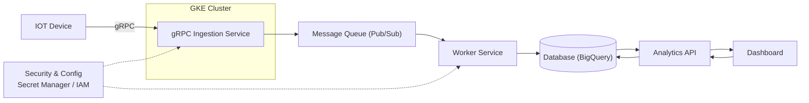

# Real-Time Data Processing System

## 🚀 Overview
This project simulates a real-time data ingestion system designed to handle large-scale device data using gRPC and asynchronous processing.

---

## 🏗️ Architecture

---

## ⚙️ Tech Stack
- Node.js (gRPC)
- Redis / Kafka
- PostgreSQL
- Docker

---

## 🔄 Data Flow

Devices → gRPC Server → Queue → Workers → Database

---

## ⚡ Key Features

- gRPC streaming ingestion
- Event-driven architecture
- Horizontal scaling with workers
- Fault-tolerant processing

---

## 📈 Scaling Strategy

- Stateless ingestion service
- Parallel worker processing
- Queue-based decoupling

---

## 💰 Cost Optimization (Inspired by production)

- Data retention strategy
- Batch processing
- Efficient storage usage

---

## 🧠 Learnings

- Async processing improves scalability
- Worker-based architecture increases throughput
- Trade-offs between consistency and performance
